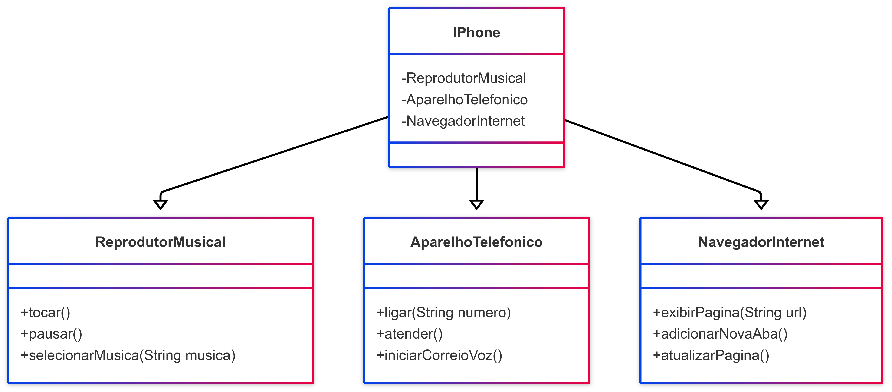

# Meu Projeto iPhone - DIO Trilha Java Básico

## Descrição

Este projeto faz parte da trilha de Java Básico da DIO (Digital Innovation One) e tem como objetivo modelar e diagramar as funcionalidades de um componente iPhone, conforme apresentado no vídeo de lançamento do iPhone de 2007. O foco é criar um diagrama UML que represente as funcionalidades de Reprodutor Musical, Aparelho Telefônico e Navegador na Internet, além de implementar (opcionalmente) as classes correspondentes em Java.

## Contexto

Com base no vídeo de lançamento do iPhone (minutos 00:15 até 00:55), as funcionalidades principais a serem modeladas são:

- **Reprodutor Musical**: Tocar, pausar e selecionar músicas.
  - **Aparelho Telefônico**: Fazer ligações, atender chamadas e iniciar correio de voz.
  - **Navegador na Internet**: Exibir páginas, adicionar novas abas e atualizar páginas.

O objetivo é criar um diagrama UML usando uma ferramenta como Mermaid e, opcionalmente, implementar as classes Java correspondentes.

## Diagrama UML

Abaixo está o diagrama UML que representa as funcionalidades do iPhone, exportado como imagem SVG.



## Implementação em Java

As classes e interfaces foram implementadas em Java conforme as especificações. Os arquivos incluem:

- `ReprodutorMusical.java`: Interface para o reprodutor musical.
  - `AparelhoTelefonico.java`: Interface para o aparelho telefônico.
  - `NavegadorInternet.java`: Interface para o navegador na internet.
  - `IPhone.java`: Classe principal que implementa todas as interfaces.

Você pode encontrar os arquivos Java no diretório raíz deste repositório. Para compilar e executar, use:

```bash
javac *.java
java IPhone